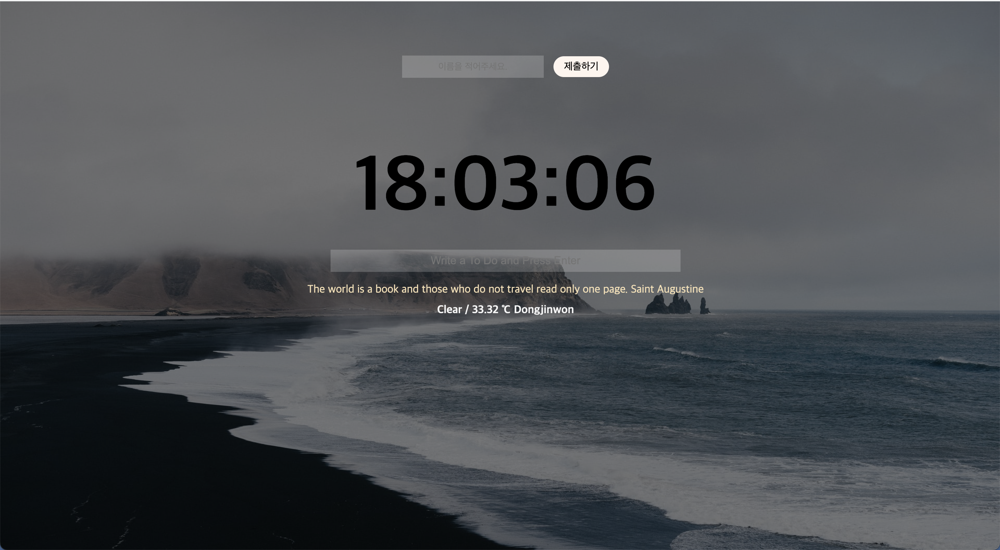
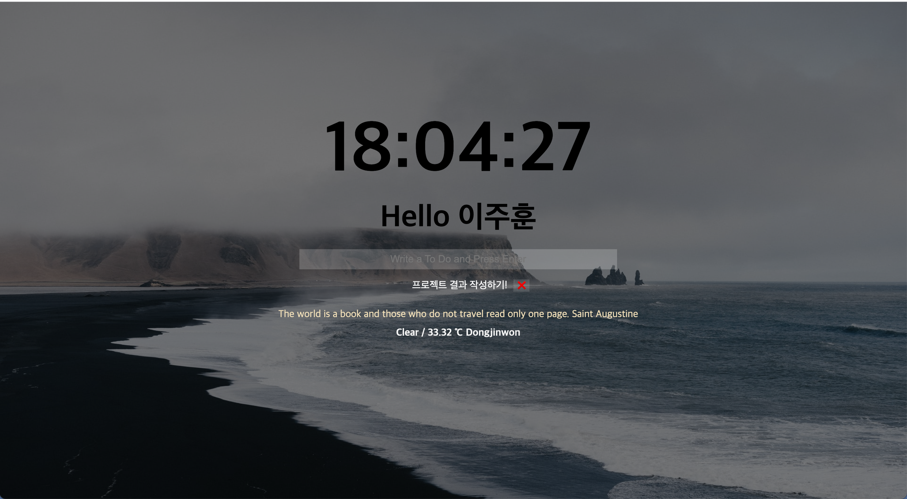

# Momentum Clone

## 📜 소개
**Momentum**이라는 웹페이지를 클론코딩하는 토이 프로젝트 입니다.

현재 웹페이지에서 제공하는 핵심 기능 4가지입니다.

1. 입력자의 로그인 기능
2. 실시간 시간
3. 날씨, 명언, 배경화면 가져오기
4. todo리스트 작성

첨부된 이미지는 완성된 프로젝트의 홈화면을 보여줍니다.

## 🛠 기술 스택
* JS
* HTML, CSS

## 🖥 CODE STRUCTURE
* image
  
* js
  - clock.js
  - login.js
  - background.js
  - quote.js
  - todo.js
  - weather.js
 
* style
  - style.css

*index.html
